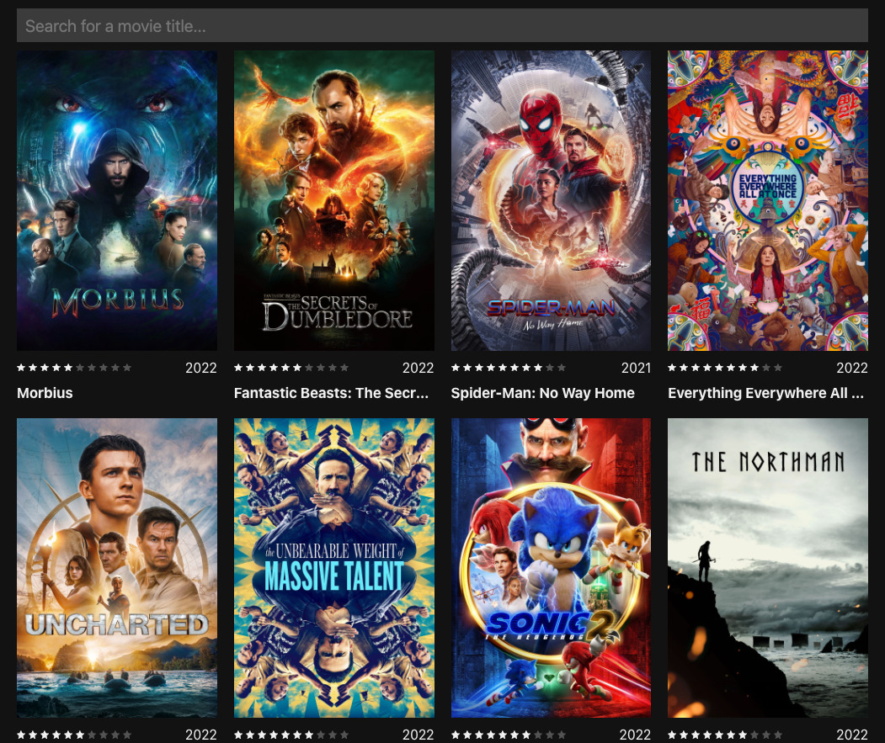

# 🍿 Torrent Streaming

Watch video torrents online. Streams them directly to your browser.



### Getting Started

```shell
cp client/.env.example client/.env
cp server/.env.example server/.env

npm install
npm start
```

### CLI Scripts

```shell
# Add an email to the list of authorised emails
npm --prefix server run add-authorised-email username@domain.tld

# Add and update streams in database from YTS API
npm --prefix server run update-movies
```

### Production

```shell
cp client/.env.example client/.env
cp server/.env.example server/.env

npm install
npm run build

npm add -g pm2
pm2 startup

pm2 start --name server /var/www/torrent-streaming/server/build/index.js
pm2 save
```
