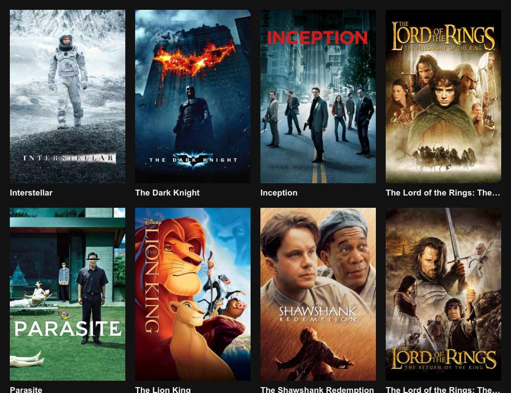

# Torrent Streaming

Watch torrents online. Streams them directly to your browser.



### Getting Started

```shell
cp client/env.example.ts client/env.ts
cp server/env.example.ts server/env.ts

npm install
npm start
```

### CLI Scripts

```shell
# Add an email to the list of authorised emails
npm --prefix server run add-authorised-email username@domain.tld

# Add and update streams in database from YTS API
npm --prefix server run update-movies
```

### Production

```shell
# Build the client container
DOCKER_BUILDKIT=1 docker build client \
  --rm \
  -f client/Dockerfile \
  -t torrent-streaming/client \
  --build-arg NODE_ENV=production \
  --build-arg PORT=8080 \
  --build-arg API_URL=http://localhost:3000

# Run the client container
docker run --rm -p 8080:8080 torrent-streaming/client
```
